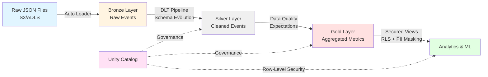

# End-to-End Governed AI Lakehouse

[](https://databricks.com)
[](https://delta.io)
[](https://python.org)
[](https://www.databricks.com/product/unity-catalog)

Production-grade data lakehouse implementing medallion architecture with Auto Loader, Delta Live Tables, and Unity Catalog governance.

## 🏗️ Architecture


**Pipeline Flow:**
1. Auto Loader ingests JSON files with automatic schema evolution
2. Bronze layer stores raw events with rescue columns
3. Silver layer enforces data quality via `@dlt.expect_or_drop` decorators
4. Gold layer aggregates metrics for analytics and ML
5. Unity Catalog enforces row-level security and PII masking

---

## 🛠️ Tech Stack

| Component | Technology | Purpose |
|-----------|-----------|---------|
| **Compute** | Databricks | Unified analytics platform |
| **Ingestion** | Auto Loader | Schema-aware streaming ingestion |
| **Transformation** | Delta Live Tables | Declarative ETL with data quality |
| **Storage** | Delta Lake | ACID transactions, time travel |
| **Governance** | Unity Catalog | Fine-grained access control |
| **Testing** | Pytest | Unit tests for data quality logic |

---

## 🚀 Setup

### Prerequisites
- Databricks workspace with Unity Catalog
- Cloud storage (S3/ADLS/GCS)
- DBR 13.3 LTS+

### Deployment
```bash
git clone https://github.com/todimaajay1/governed-ai-lakehouse.git
cd governed-ai-lakehouse
```

**1. Configure Storage Paths**

Update `src/ingestion.py` with your cloud storage locations:
```python
source_path = "s3://your-bucket/raw/"
checkpoint_location = "s3://your-bucket/checkpoints/"
schema_location = "s3://your-bucket/schemas/"
```

**2. Deploy Governance Layer**

Run in Databricks SQL Editor:
```sql
-- Execute src/governance.sql
```

Creates catalogs, schemas, RLS functions, and permissions.

**3. Create DLT Pipeline**

In Databricks UI:
- Workflows → Delta Live Tables → Create Pipeline
- Source: `src/dlt_pipeline.py`
- Target Catalog: `main`
- Mode: Triggered

**4. Run Pipeline**
```python
# In Databricks notebook
%run ./src/ingestion.py
```

---

## 🔐 Governance Features

### Row-Level Security

Dynamic data masking based on user groups:

| Role | Access Level |
|------|-------------|
| `admin` | Full PII visibility |
| `analyst` | Masked emails (***@domain.com), partial IPs |
| Default | All PII redacted |

Implementation via Unity Catalog functions:
```sql
CREATE FUNCTION filter_sensitive_data(...)
RETURNS STRUCT<...>
RETURN CASE
  WHEN is_account_group_member('admin') THEN ...
```

### Data Quality

DLT expectations enforce quality contracts:
```python
@dlt.expect_or_drop("valid_event_id", "event_id IS NOT NULL")
@dlt.expect_or_drop("valid_timestamp", "event_timestamp IS NOT NULL")
@dlt.expect_or_drop("valid_user_id", "user_id IS NOT NULL AND user_id != ''")
```

Violations are automatically logged and tracked in DLT metrics.

---

## 💡 Key Design Decisions

**Auto Loader vs Traditional Streaming**
- Automatic schema inference and evolution
- Handles file discovery without manual partitioning
- `rescue` mode prevents data loss during schema changes

**Declarative Expectations vs Imperative Filters**
- Better observability with built-in metrics
- Automatic failure tracking
- Cleaner code separation of business logic

**Unity Catalog vs Table ACLs**
- Centralized governance across workspaces
- Dynamic row-level security
- Function-based PII masking vs static views

**Production Patterns**
- `trigger(availableNow=True)` for cost-efficient batch processing
- `.dropDuplicates()` ensures idempotent reprocessing
- Comprehensive type hints and docstrings

---

## 📁 Project Structure
```
governed-ai-lakehouse/
├── src/
│   ├── ingestion.py       # Auto Loader streaming ingestion
│   ├── dlt_pipeline.py    # Medallion architecture (Bronze→Silver→Gold)
│   └── governance.sql     # Unity Catalog RLS policies
├── tests/
│   └── test_data_quality.py  # Data quality validation tests
├── requirements.txt
└── README.md
```

---

## 🎯 Real-World Applications

This pattern is used in production at:
- **Netflix** - Content recommendation pipelines
- **Uber** - Ride analytics and fraud detection
- **Comcast** - Customer behavior analysis

---

## 📧 Contact

**Ajay Todima**  
📧 todimaajay1@gmail.com  
🔗 [LinkedIn](www.linkedin.com/in/ajay-todima-8aa0352a8)  
🐙 [GitHub](https://github.com/todimaajay1)

---

**Built with Databricks best practices**